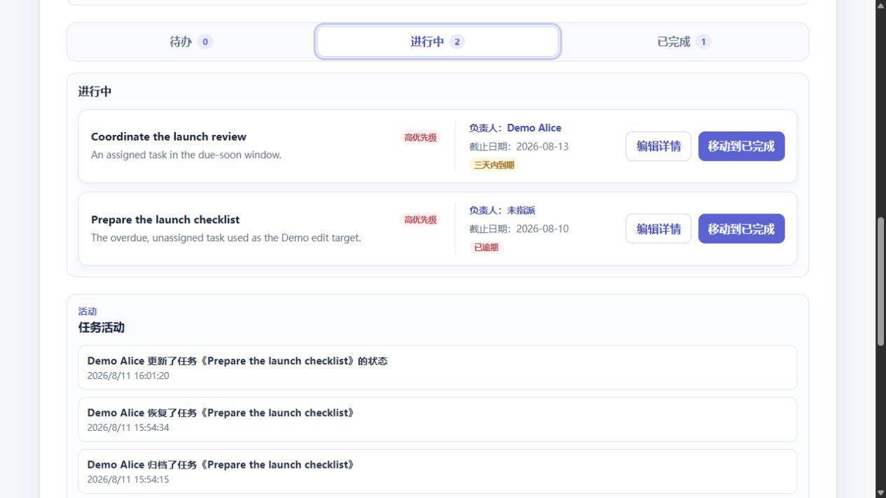
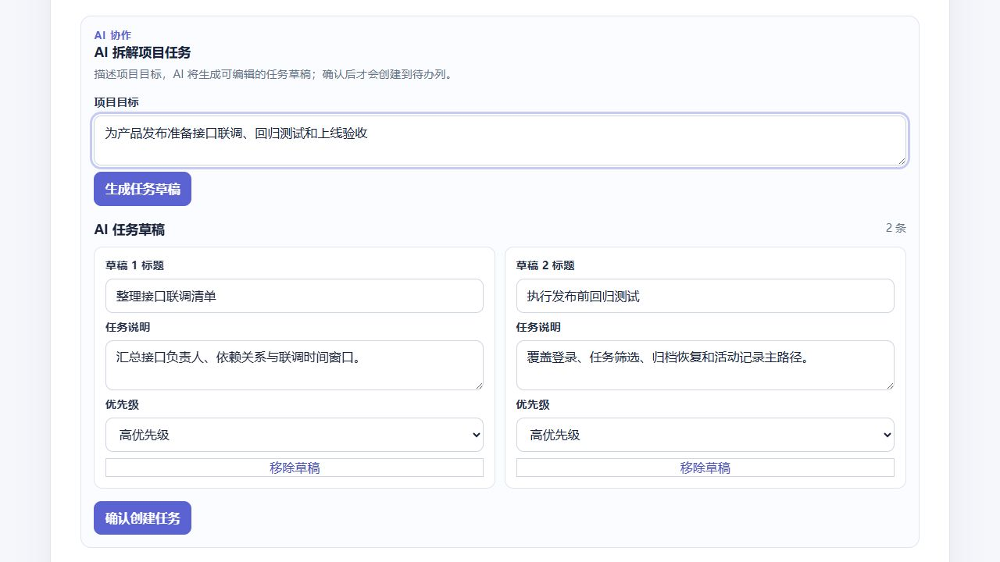

# AI Collaboration Workspace

面向小型团队的全栈协同任务系统，展示 React 前端交互、NestJS REST API、PostgreSQL 关系建模、团队权限控制和 SiliconFlow AI 任务拆解。

## 已实现功能

- 用户注册、登录、Cookie 会话恢复与退出登录
- 团队创建、成员邀请和团队内项目管理
- 可在待办、进行中、已完成状态标签间切换的任务看板
- 任务创建、详情编辑、负责人分配、优先级、截止日期与状态流转
- 按关键词、负责人、优先级和截止状态组合筛选；筛选条件保存在 URL 中
- 截止日期的“今天到期”“三天内到期”“已逾期”提示
- 已完成任务归档、归档区查看与恢复
- 创建、编辑、状态、负责人、归档和恢复的任务活动记录
- 输入项目目标后生成可编辑的 AI 任务草稿，确认后批量加入待办列
- 只写入固定数据、可重复执行且拒绝在生产环境运行的本地 Demo seed

普通任务操作不依赖 AI。未配置 SiliconFlow 或外部服务不可用时，AI 区会显示“AI 服务尚未配置”、超时、限流、认证失败或暂时不可用等错误；现有看板、筛选和手工任务流程仍可继续使用。

## 技术栈与目录

- 前端：React 19、React Router、TypeScript、Vite、Vitest、Testing Library
- 后端：NestJS 11、TypeScript、TypeORM、Jest、Supertest
- 数据库：PostgreSQL，使用 `pgcrypto` 扩展、基础 Schema 和版本化 SQL migration

```text
apps/web                  React 前端
apps/api                  NestJS API
apps/api/sql/schema.sql   空数据库的完整结构
apps/api/sql/migrations   现有数据库的增量升级脚本
docs                      设计、实施计划与 Demo 脚本
```

## 功能架构

```text
React UI
  → Cookie 认证的 REST API
  → 项目所属团队成员权限校验
  → TypeORM 事务（任务变更与活动记录同时持久化）
  → PostgreSQL

可选 AI 链路：React → 项目 AI 接口 → SiliconFlow
```

AI 返回的任务只作为客户端可编辑草稿；用户点击“确认创建任务”后才通过任务接口写入。AI 请求、解析或提供商失败只在 AI 区显示错误，不阻塞看板、筛选和手工任务操作。

## 本地前提

- Windows PowerShell
- Node.js 与 npm（仓库使用 npm workspaces）
- 可创建数据库并启用 `pgcrypto` 的 PostgreSQL
- `psql`（初始化空数据库时用于执行 `apps/api/sql/schema.sql`）

## 环境变量

复制 `apps/api/.env.example` 为 `apps/api/.env`，只在本地文件中填写真实值。不要提交数据库连接串、JWT 密钥、Demo 密码或 AI Key。

| 变量 | 必需性 | 用途 |
| --- | --- | --- |
| `PORT` | 可选 | API 端口；示例值和代码默认值均为 `3001`。 |
| `DATABASE_URL` | 必需 | API、migration 和 Demo seed 使用的 PostgreSQL 连接串。 |
| `DEMO_USER_PASSWORD` | 运行 Demo seed 时必需 | 本地 Demo 用户密码；seed 会以 bcrypt cost 12 哈希后写入。 |
| `TEST_DATABASE_ADMIN_URL` | 运行 seed E2E 时必需 | 有权创建和删除测试数据库的管理连接；测试只允许操作 `ai_collaboration_workspace_seed_test`。 |
| `NODE_ENV` | 可选 | `production` 时登录 Cookie 使用 secure 标记，且 Demo seed 会拒绝运行；`test` 时 API 不注册真实数据库连接。 |
| `JWT_SECRET` | 必需 | 登录会话 JWT 签名密钥。 |
| `CORS_ORIGIN` | 可选 | 允许携带 Cookie 访问 API 的前端源；默认 `http://localhost:5173`。 |
| `SILICONFLOW_API_KEY` | 使用 AI 时必需 | SiliconFlow API Key；留空时 AI 接口返回“AI 服务尚未配置”。 |
| `SILICONFLOW_BASE_URL` | 可选 | SiliconFlow API 基址；默认 `https://api.siliconflow.cn/v1`。 |
| `SILICONFLOW_MODEL` | 可选 | 任务拆解模型；默认 `Qwen/Qwen2.5-7B-Instruct`。 |

前端未设置 `VITE_API_BASE_URL` 时会请求 `http://localhost:3001`；如果 API 地址不同，可在前端 Vite 环境中设置该变量。

## 数据库初始化与升级

`schema.sql` 和 `db:migrate` 用途不同：

- 新建的空数据库：执行 `apps/api/sql/schema.sql`，一次创建当前完整表、约束和索引。
- 已有数据库：运行 `db:migrate`，按文件名顺序执行尚未登记的增量 SQL，并记录到 `schema_migrations`。

`db:migrate` 不是空数据库基础结构的替代品；它假定原有表已经存在。以下是根目录下的 PowerShell 示例，数据库名与认证参数按你的本地 PostgreSQL 配置调整：

```powershell
psql -d ai_collaboration_workspace -f .\apps\api\sql\schema.sql
& 'C:\Program Files\nodejs\npm.cmd' run db:migrate --workspace @workspace/api
```

## 安装、Demo 数据与启动

先完成数据库和 `apps/api/.env` 配置，再在仓库根目录执行：

```powershell
& 'C:\Program Files\nodejs\npm.cmd' install
& 'C:\Program Files\nodejs\npm.cmd' run db:migrate --workspace @workspace/api
& 'C:\Program Files\nodejs\npm.cmd' run db:seed-demo --workspace @workspace/api
& 'C:\Program Files\nodejs\npm.cmd' run dev:api
& 'C:\Program Files\nodejs\npm.cmd' run dev:web
```

`dev:api` 与 `dev:web` 是持续运行的服务命令，请分别在两个 PowerShell 窗口启动。默认访问地址为 `http://localhost:5173`，API 默认监听 `http://localhost:3001`。

Demo seed 使用固定 UUID 执行 upsert，不会删除非 Demo 数据；重复运行会恢复同一套 Demo 数据，不累积重复记录。`NODE_ENV=production` 时脚本会拒绝运行。它创建：

- 登录邮箱：`demo.alice@workspace.local`（负责人）和 `demo.bob@workspace.local`（成员）
- 登录密码：你在本地 `DEMO_USER_PASSWORD` 中设置的值
- 团队：`Demo Collaboration Team`
- 项目：`Demo Product Launch`
- 覆盖逾期、临期、未指派、已完成和已归档场景的固定任务与活动记录

完整五分钟操作顺序见 [docs/demo-script.md](docs/demo-script.md)。

## Demo 截图



任务看板截图展示状态标签、两张进行中卡片、三天内到期与已逾期提示、状态操作和活动时间线。页面一次只展示一个状态列（状态面板），因此这张真实界面截图没有同时展示仅在已完成任务上出现的归档按钮；归档、归档视图和恢复流程已在浏览器演示中单独验证。



AI 截图使用确定性的本地测试响应验证两条可编辑草稿及“确认创建任务”按钮，只说明草稿确认前的 UI 状态，不是外部 SiliconFlow 成功响应的证据；外部服务不可用时仍按前述错误降级处理。

## 测试与构建

```powershell
& 'C:\Program Files\nodejs\npm.cmd' run test
& 'C:\Program Files\nodejs\npm.cmd' run build
```

根命令会分别运行 API 与 Web workspace 的测试或构建。Demo seed 另有真实 PostgreSQL E2E：

```powershell
& 'C:\Program Files\nodejs\npm.cmd' run test:seed --workspace @workspace/api
```

该测试要求 `TEST_DATABASE_ADMIN_URL`，只会创建、重建并清理名称精确为 `ai_collaboration_workspace_seed_test` 的一次性数据库；它应用 `schema.sql` 与 migrations，两次执行 seed，并验证固定数据数量不增长以及非 Demo 数据未被删除。
