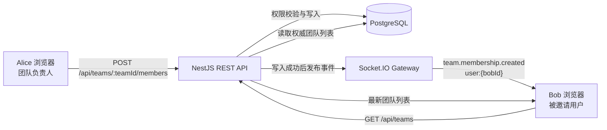
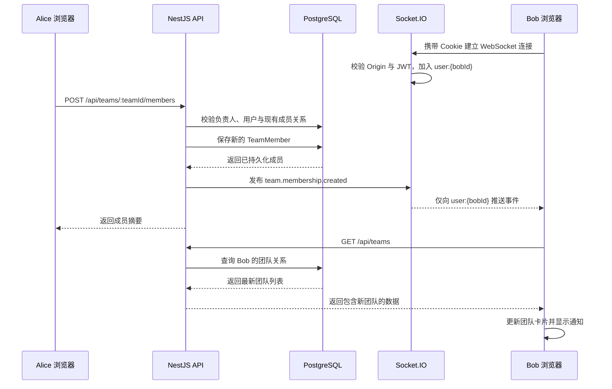

# 从一次团队邀请开始：用 React、NestJS 与 Socket.IO 做可靠的实时通知

> 这不是一个脱离业务的 WebSocket Hello World，而是我在一个真实全栈协作项目里完成团队邀请实时化的完整复盘。文章会从“为什么另一个浏览器不知道自己被邀请了”讲起，一直拆到 Cookie/JWT 握手鉴权、用户私有房间、REST 数据回源、断线重连、竞态处理和自动化测试。

## 发布信息

- **建议分类**：前端、后端
- **建议标签**：React、NestJS、Socket.IO、WebSocket、TypeScript
- **项目源码**：[lichenyang5/ai-collaboration-workspace](https://github.com/lichenyang5/ai-collaboration-workspace)
- **适合读者**：刚接触实时通信的前端或全栈开发者，以及希望把个人项目讲清楚的求职者

## 1. 项目背景：邀请成功了，为什么另一个浏览器毫无反应

团队邀请本身并不复杂：负责人输入邮箱，前端调用接口，后端在 `team_members` 表里增加一条关系。最早的实现已经能完成这件事，但它只解决了“数据库里有没有这个成员”，没有解决“被邀请的人什么时候知道”。

为了看清问题，可以把参与者分成两个浏览器：

- Alice 是团队负责人，登录在普通窗口；
- Bob 是被邀请用户，登录在无痕窗口；
- 两个窗口有各自的 Cookie、React 状态和网络连接。

Alice 点击邀请以后，请求链路是：

```text
Alice 页面 -> POST 邀请接口 -> 数据库写入 -> 响应 Alice 页面
```

响应只会沿着发起请求的连接返回 Alice。Bob 没有发请求，服务端也没有一条可以主动联系 Bob 的通道，所以他的 React 页面当然不会变化。即使 Alice 页面已经把 Bob 加入成员数组，也只是更新了 Alice 浏览器内存中的状态，不可能跨浏览器修改 Bob 的状态。

最粗暴的办法是让 Bob 手动刷新。刷新后 `GET /api/teams` 会从数据库读到新关系，数据是正确的，但体验不像协作应用。我们希望达到的是：

1. Alice 的邀请仍由原来的 REST 接口完成；
2. 数据库确认写入后，在线的 Bob 立即收到“你已加入某团队”；
3. Bob 的团队列表自动重新读取，不依赖手动刷新；
4. Bob 离线或实时连接失败时，数据库结果仍然正确；
5. 重复邀请不能产生重复成员或重复通知。

这里的关键不是给按钮加一个动画，而是建立一条跨会话的数据同步链路。

## 2. 先补基础：HTTP、WebSocket 与 Socket.IO 到底是什么

在选择技术以前，需要先把三个经常被混在一起的概念分开。

### 2.1 HTTP：一次请求对应一次响应

普通 REST 请求的模型很好理解：客户端发起请求，服务端处理，然后返回响应。只要 Bob 不发起请求，服务端就没有一个现成的 HTTP 响应可以“顺便”塞给 Bob。

HTTP 非常适合权限校验、参数验证、数据库增删改查和明确的成功/失败语义。因此，本项目没有因为加入实时功能就放弃 REST。邀请动作依然是：

```http
POST /api/teams/:teamId/members
Content-Type: application/json

{
  "email": "bob@example.com"
}
```

### 2.2 WebSocket：建立以后可以双向通信

WebSocket 会先通过 HTTP Upgrade 建立连接，成功后连接保持打开。此后客户端和服务端都可以主动发送消息，不需要每条消息重新建立一次 HTTP 请求。

这正好补上前面的缺口：Bob 登录后维持连接，服务端在成员关系落库后就能沿着这条连接通知 Bob。

但原生 WebSocket 只提供比较底层的连接和消息能力。实际项目还会遇到事件命名、自动重连、心跳、房间、类型约束和握手鉴权。全部自行封装并不划算。

### 2.3 Socket.IO：不是 WebSocket 的另一个名字

Socket.IO 是建立在实时传输之上的事件通信库。它提供：

- `socket.on('事件名', handler)` 形式的事件订阅；
- 自动重连和连接生命周期事件；
- 服务端房间，可以向某个用户或某组用户定向发送；
- 客户端和 NestJS 服务端较成熟的集成。

需要注意：Socket.IO 有自己的协议，不能拿原生 WebSocket 客户端直接连接 Socket.IO 服务端。本项目在客户端明确配置 `transports: ['websocket']`，意思是 Socket.IO 只采用 WebSocket transport，而不是说我们绕开了 Socket.IO 协议。

这个功能目前只使用“服务端通知客户端”方向，但以后如果加入在线状态、协同编辑或任务事件，仍然可以继续沿用同一个连接体系。

## 3. 方案比较：轮询、SSE 还是 WebSocket

实时更新不是只有 WebSocket 一条路，选择之前应先比较业务需要。

| 方案 | 做法 | 优点 | 代价 | 对当前项目的适配度 |
| --- | --- | --- | --- | --- |
| 定时轮询 | Bob 每隔几秒请求一次团队列表 | 最简单，完全复用 HTTP | 无变化也会请求；实时性取决于间隔 | 能做，但作品展示效果和扩展性一般 |
| SSE | 服务端通过一个 HTTP 长连接持续向客户端推送 | 浏览器原生支持；适合单向事件流 | 主要是服务端到客户端；连接管理方式不同 | 当前通知能用，但后续双向协作扩展受限 |
| WebSocket / Socket.IO | 登录后维持实时连接，通过事件定向通知 | 延迟低；支持双向；房间与重连成熟 | 需要额外处理鉴权、Origin、断线和多实例 | 与协作工作区的后续方向最匹配 |

如果产品永远只有一个低频通知，轮询或 SSE 都可能更省事。这个项目选择 Socket.IO，不是因为“实时功能就必须 WebSocket”，而是因为它本来就是协作工作区，未来天然可能继续出现团队、项目或任务层面的实时事件。

同时我们保持了一个很重要的克制：本次只实现团队邀请，不顺手扩展聊天、在线人数或任务广播。先把一条链路做可靠，比同时铺开很多不完整功能更有价值。

## 4. 总体架构：消息是提醒，REST 才是账本

这个功能最重要的设计决定，不是“用了 Socket.IO”，而是没有把 Socket.IO 变成第二套数据接口。

服务端为每个已登录用户建立 `user:{userId}` 私有房间；实际邀请 Bob 时，房间名会展开为 `user:{bobId}`。

一句话记忆：**消息是提醒，REST 才是账本。**

也就是说，Socket.IO 事件只告诉 Bob：“团队成员关系发生了变化，你应该重新同步。”真正决定 Bob 属于哪些团队的，仍然是 PostgreSQL 和 `GET /api/teams`。

这样设计有几个直接收益：

1. **只有一个权威来源。** 页面刷新、重新登录和实时事件最终都读取同一份数据库数据。
2. **事件负担更小。** 通知只携带 toast 和跳转需要的信息，不必复制完整团队、成员和项目结构。
3. **断线不会破坏业务。** Socket.IO 挂了，Alice 的 REST 邀请仍能成功；Bob 稍后刷新仍能看到团队。
4. **前端更容易恢复。** 不需要计算漏掉了哪些事件，只要重新请求当前快照。

事件的数据结构很小：

```ts
export interface TeamMembershipCreatedEvent {
  eventId: string;
  teamId: string;
  teamName: string;
  role: 'member';
  occurredAt: string;
}
```

其中 `eventId` 使用已经保存的成员关系 ID，前端可据此去重；`teamId` 和 `teamName` 用于通知与跳转；`role` 明确本次新成员只能是 `member`；`occurredAt` 记录关系创建时间。它故意不携带项目列表，因为那些数据应通过 REST 获取。



## 5. 一次邀请的完整时序

下面先从全局看 Alice 邀请 Bob 时发生了什么，后面再逐层展开每一段代码。



按时间顺序理解这张图：

1. Bob 登录后，前端创建 Socket.IO 连接。握手携带登录 Cookie。
2. 服务端验证 Origin、解析 `access_token`、校验 JWT，然后把连接加入 Bob 的私有房间。
3. Alice 提交邀请。REST 服务先验证 Alice 是负责人，再查团队、用户和现有关系。
4. 只有新成员关系真正保存成功，服务端才构造 `team.membership.created`。
5. Gateway 只向 `user:{bobId}` 发送，Alice 和其他在线用户不会收到。
6. Bob 前端一方面把事件放入通知队列，另一方面触发团队列表重新加载。
7. `GET /api/teams` 返回数据库快照，Bob 的工作区出现新团队。

这里有一个容易忽略的先后约束：**必须先保存，再通知。** 如果先发事件再写数据库，Bob 可能立刻请求团队列表，但数据库还没有成员关系，于是页面仍然看不到新团队。当前实现用保存成功后的返回值生成事件，避免了这个顺序错误。

## 6. 后端实现：Gateway、Cookie/JWT 鉴权与用户房间

后端需要解决的不是“把消息广播出去”，而是确认连接是谁，并且只把邀请通知发送给正确的人。

### 6.1 NestJS Gateway 的职责

Gateway 的关键配置如下，省略了 TypeScript 类型声明：

```ts
const allowedOrigin = process.env.CORS_ORIGIN ?? 'http://localhost:5173';

@WebSocketGateway({
  allowRequest: (request, callback) => {
    callback(null, request.headers.origin === allowedOrigin);
  },
  cors: {
    origin: allowedOrigin,
    credentials: true,
  },
})
export class RealtimeGateway {
  @WebSocketServer()
  server!: RealtimeServer;
}
```

这里同时出现了 `allowRequest` 和 `cors`。CORS 配置让合法浏览器来源可以携带凭据；`allowRequest` 则在 Engine.IO 接受连接之前，严格比较请求的 `Origin`。不同来源或没有 Origin 的请求会被拒绝。

为什么不能只写 `cors`？因为 CORS 主要是浏览器执行的跨源访问规则，不应该被当成服务端身份鉴权。这里把来源校验放在接入层，再在下一步校验 Cookie/JWT，两道检查解决的是不同问题。

### 6.2 握手阶段复用登录 Cookie

REST 登录已经把 JWT 放在 HttpOnly Cookie `access_token` 中。HttpOnly 的好处是页面 JavaScript 不能直接读取 token，降低 token 被脚本窃取的风险。建立 Socket.IO 连接时，浏览器仍可以自动携带 Cookie。

服务端中间件在连接进入正常生命周期前完成鉴权：

```ts
afterInit(server: RealtimeServer): void {
  server.use(async (client, next) => {
    try {
      client.data.user = await this.auth.authenticate(
        client.handshake.headers.cookie,
      );
      next();
    } catch {
      next(new Error('Unauthorized'));
    }
  });
}
```

`RealtimeAuthService` 的工作分成四步：

```ts
const token = parse(cookieHeader ?? '').access_token;
if (!token) throw new UnauthorizedException('请先登录');

const payload = await jwtService.verifyAsync<JwtPayload>(token);
if (!payload.sub || !payload.email) throw new Error('invalid payload');

return { id: payload.sub, email: payload.email };
```

它解析 Cookie、取出 token、验证签名和有效期，并要求 payload 中存在 `sub` 与 `email`。验证结果放入 `client.data.user`。客户端不能在事件参数中谎报“我是 Bob”，因为房间身份来自服务端验证过的 JWT。

鉴权放在 namespace middleware 里也很关键。如果先触发已连接逻辑、后异步检查身份，未认证连接可能短暂进入房间或触发其他生命周期操作。当前顺序是“先认证，后 connection”。

### 6.3 每个用户一个私有房间

连接通过以后，Gateway 使用服务端认证结果加入房间：

```ts
async handleConnection(client: AuthenticatedSocket): Promise<void> {
  await client.join(`user:${client.data.user.id}`);
}

emitToUser(userId: string, event: string, payload: unknown): void {
  this.server.to(`user:${userId}`).emit(event, payload);
}
```

房间不是数据库表，只是当前 Socket.IO 进程里的连接分组。同一个 Bob 同时打开两个已登录页面时，两个 socket 都可以加入 `user:{bobId}`，两处页面都会实时收到通知。Alice 的连接在 `user:{aliceId}`，不会被误发。

### 6.4 用 Notifier 隔离业务与传输层

`TeamsService` 不直接操作 Socket.IO Server，而是依赖一个很薄的 `RealtimeNotifier`：

```ts
notifyTeamMembershipCreated(userId, payload): void {
  try {
    this.gateway.emitToUser(userId, TEAM_MEMBERSHIP_CREATED, payload);
  } catch {
    this.logger.error(
      `Failed to emit ${TEAM_MEMBERSHIP_CREATED} to user ${userId}`,
    );
  }
}
```

这样团队服务只表达“通知某个用户成员关系已创建”，不用知道房间格式和 Socket.IO API。通知失败会记录错误，但不会把已经成功的数据库写入反向变成邀请失败。因为成员关系才是业务事实，toast 只是即时体验。

## 7. 邀请写入与幂等：为什么重复邀请不会重复通知

数据库唯一约束、服务层查询和事件发布时间共同决定了用户是否会收到重复通知。

### 7.1 先做业务检查

`addTeamMember` 按以下顺序执行：

1. `requireOwner` 确认请求者已经属于团队且角色为 `owner`；
2. 查询团队，拿到事件需要的 `id` 和 `name`；
3. 把邮箱 `trim()` 并转成小写，查找已注册用户；
4. 查询该用户是否已经是当前团队成员。

不存在的注册用户会得到“未找到该邮箱对应的已注册用户”，普通成员尝试邀请会得到“只有团队负责人可以邀请成员”。这些仍是 REST 错误，不会经过实时通道。

如果第 4 步已经找到成员，服务直接返回成员摘要：

```ts
if (existingMember) {
  return this.toTeamMemberSummary(existingMember);
}
```

这里没有调用 Notifier，所以 Alice 重复邀请 Bob 时，Alice 可以得到一致的成员结果，Bob 不会再看到一次“你已加入”。

### 7.2 只有保存成功才发布

新成员路径的核心代码可以压缩成：

```ts
const member = teamMemberRepository.create({
  team: { id: teamId } as Team,
  user,
  role: TeamMemberRole.Member,
});

const savedMember = await teamMemberRepository.save(member);

realtimeNotifier.notifyTeamMembershipCreated(user.id, {
  eventId: savedMember.id,
  teamId: team.id,
  teamName: team.name,
  role: 'member',
  occurredAt: savedMember.createdAt.toISOString(),
});
```

事件位于 `await save()` 之后，因此不会为失败的数据库写入发送“成功通知”。Alice 收到的成员摘要和 Bob 收到的事件，都来自同一个已持久化实体。

### 7.3 为什么查过一次仍要处理 `23505`

“先查是否存在”只能处理普通重复点击，挡不住并发：两个请求可能同时查到“不存在”，然后都尝试插入。

实体上还有最后一道数据库约束：

```ts
@Entity({ name: 'team_members' })
@Unique(['team', 'user'])
export class TeamMember { /* ... */ }
```

PostgreSQL 唯一约束冲突的错误码是 `23505`。当前服务捕获这个特定错误，再查询已经由另一个请求写入的成员关系并返回：

```ts
if (
  error instanceof QueryFailedError &&
  (error.driverError as { code?: unknown }).code === '23505'
) {
  const persistedMember = await teamMemberRepository.findOne(/* ... */);
  if (persistedMember) return this.toTeamMemberSummary(persistedMember);
}
throw error;
```

发生竞争时，只有真正插入成功的请求走到通知语句；唯一约束失败的请求只恢复并返回已有关系，不再发布事件。数据库约束保证“最多一条成员关系”，服务分支保证“最多一次创建通知”。

这里体现的是幂等的用户体验：相同邀请执行一次或多次，最终看到的成员关系相同，也不会因为重试制造通知风暴。

## 8. 前端实现：RealtimeProvider、通知队列与 REST 回源

前端把连接生命周期放入 Provider，把展示和数据同步拆成不同职责。

## 9. 真正困难的部分：异步竞态与会话隔离

能够收到一条事件只是开始；可靠实现还必须处理切换账号、重复点击、旧请求后返回和断线恢复。

## 10. 安全边界：Origin、Cookie 与 WebSocket transport

WebSocket 是长连接，但它并不会自动继承 REST 端所有安全保证。

## 11. 如何证明功能可靠：自动化测试与真实握手

测试需要分别证明纯逻辑、真实握手、页面交互和最终人工效果。

## 12. 双浏览器验证与常见故障排查

一个普通窗口和一个无痕窗口，能够模拟两个完全独立的 Cookie 会话。

## 13. 面试时怎么讲：一分钟版与三分钟版

实现完成以后，还需要把技术选择、难点和结果说清楚。

## 14. 总结

实时协作的价值不在于页面多了一个弹窗，而在于不同用户看到的数据能够及时、可解释地重新对齐。
