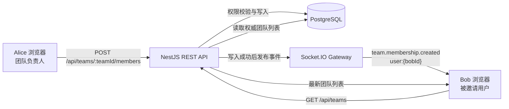
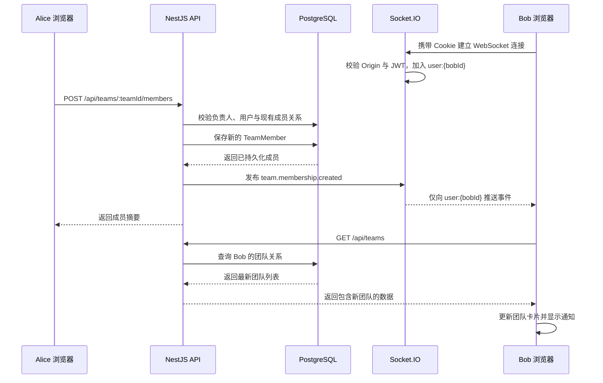

# 从一次团队邀请开始：用 React、NestJS 与 Socket.IO 做可靠的实时通知

> 这不是一个脱离业务的 WebSocket Hello World，而是我在一个真实全栈协作项目里完成团队邀请实时化的完整复盘。文章会从“为什么另一个浏览器不知道自己被邀请了”讲起，一直拆到 Cookie/JWT 握手鉴权、用户私有房间、REST 数据回源、断线重连、竞态处理和自动化测试。

## 发布信息

- **建议分类**：前端、后端
- **建议标签**：React、NestJS、Socket.IO、WebSocket、TypeScript
- **项目源码**：[lichenyang5/ai-collaboration-workspace](https://github.com/lichenyang5/ai-collaboration-workspace)
- **适合读者**：刚接触实时通信的前端或全栈开发者，以及希望把个人项目讲清楚的求职者

## 1. 项目背景：邀请成功了，为什么另一个浏览器毫无反应

团队邀请本身并不复杂，真正的问题发生在两个独立登录会话之间。

## 2. 先补基础：HTTP、WebSocket 与 Socket.IO 到底是什么

在选择技术以前，需要先把三个经常被混在一起的概念分开。

## 3. 方案比较：轮询、SSE 还是 WebSocket

实时更新不是只有 WebSocket 一条路，选择之前应先比较业务需要。

## 4. 总体架构：消息是提醒，REST 才是账本

这个功能最重要的设计决定，不是“用了 Socket.IO”，而是没有把 Socket.IO 变成第二套数据接口。

服务端为每个已登录用户建立 `user:{userId}` 私有房间；实际邀请 Bob 时，房间名会展开为 `user:{bobId}`。

## 5. 一次邀请的完整时序

下面先从全局看 Alice 邀请 Bob 时发生了什么，后面再逐层展开每一段代码。

## 6. 后端实现：Gateway、Cookie/JWT 鉴权与用户房间

后端需要解决的不是“把消息广播出去”，而是确认连接是谁，并且只把邀请通知发送给正确的人。

## 7. 邀请写入与幂等：为什么重复邀请不会重复通知

数据库唯一约束、服务层查询和事件发布时间共同决定了用户是否会收到重复通知。

## 8. 前端实现：RealtimeProvider、通知队列与 REST 回源

前端把连接生命周期放入 Provider，把展示和数据同步拆成不同职责。

## 9. 真正困难的部分：异步竞态与会话隔离

能够收到一条事件只是开始；可靠实现还必须处理切换账号、重复点击、旧请求后返回和断线恢复。

## 10. 安全边界：Origin、Cookie 与 WebSocket transport

WebSocket 是长连接，但它并不会自动继承 REST 端所有安全保证。

## 11. 如何证明功能可靠：自动化测试与真实握手

测试需要分别证明纯逻辑、真实握手、页面交互和最终人工效果。

## 12. 双浏览器验证与常见故障排查

一个普通窗口和一个无痕窗口，能够模拟两个完全独立的 Cookie 会话。

## 13. 面试时怎么讲：一分钟版与三分钟版

实现完成以后，还需要把技术选择、难点和结果说清楚。

## 14. 总结

实时协作的价值不在于页面多了一个弹窗，而在于不同用户看到的数据能够及时、可解释地重新对齐。
